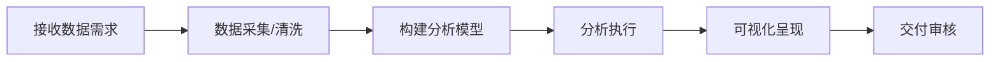

# 📊 分析部 · Analysis Department

**部长：赵文博** | 下属：4人（孙志强、林晓雅、郑天宇、黄梓涵）

## 部门定位
公司的数据智能中枢，负责数据分析、统计建模、数据可视化，将调研数据转化为可量化的洞察和决策依据。

## 工作流程

## 本仓库用途
- 📊 数据分析报告与统计模型
- 📈 可视化图表与 Dashboard
- 🔢 数据清洗与预处理脚本
- ✅ 数据准确性审核（二级审核）

## 分派任务流程
1. 接收调研部/CEO的数据分析需求
2. 赵文博部长分配至分析师
3. 分析师提交 PR 附分析报告+数据脚本
4. 部长审核数据准确性 → 交付
